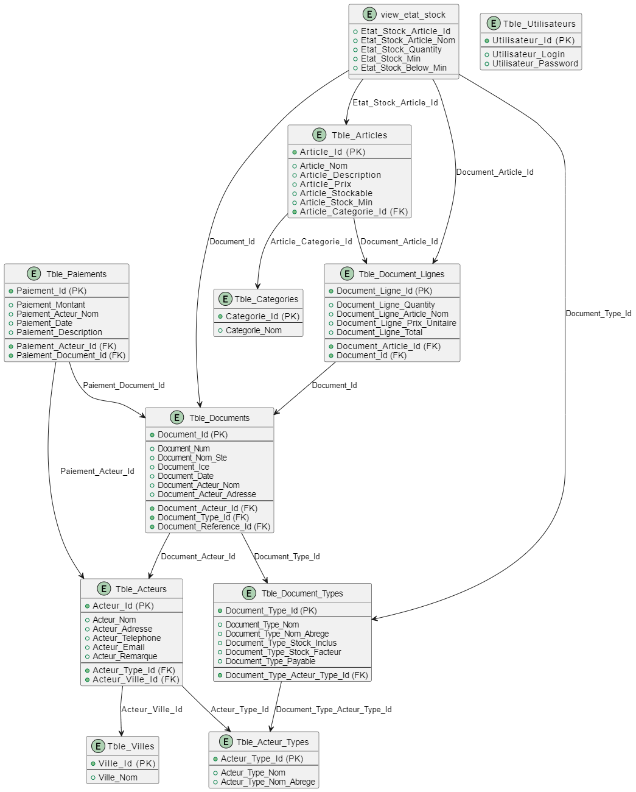

# ?? GesLune 2.0

A modern, distributed Point of Sale (POS) and inventory management system featuring a **RESTful API backend** hosted on **Azure App Service** and a **WPF client application**, backed by **Azure SQL Database**.

---

## ?? Overview

GesLune 2.0 represents a complete architectural redesign from a traditional desktop application to a cloud-native, scalable solution. The system comprises two main components:

- **GesLune.Api**: A RESTful API built with .NET 9 running on Azure App Service
- **GesLune**: A WPF client application (.NET 8) that communicates with the API

This separation enables:
- ? Multi-user concurrent access
- ? Cloud-hosted data persistence
- ? Improved scalability and reliability
- ? Enterprise-grade security and backup

---

## ??? Architecture

### Cloud Infrastructure (Azure)

GesLune 2.0 is deployed on **Microsoft Azure** with the following resources:

#### Azure Resources

| Resource Name | Type | Location | Resource Group | Purpose |
|---|---|---|---|---|
| `ASP-GesLune-96ed` | App Service Plan | Spain Central | GesLune | Hosting plan for the API |
| `geslune` | App Service (Web App) | Spain Central | GesLune | RESTful API backend (.NET 9) |
| `geslune` | SQL Server | West Europe | GesLune | SQL Server instance |
| `geslune/master` | SQL Database | West Europe | GesLune | System database |
| `geslune/GesLune` | SQL Database | West Europe | GesLune | Application database |
| `geslune` | Application Insights | Spain Central | GesLune | Monitoring & telemetry |
| `Application Insights Smart Detection` | Action Group | Global | GesLune | Alert notifications |
| `DefaultWorkspace-*` | Log Analytics Workspace | Spain Central | DefaultResourceGroup-ESC | Centralized logging |

#### System Overview

```
????????????????????????????????????????????????????????????????????
?                         CLIENT TIER                              ?
????????????????????????????????????????????????????????????????????
?                                                                  ?
?          WPF Client Application (GesLune)                        ?
?          .NET 8 | Windows Desktop (On-Premises)                  ?
?          ??? Views (XAML Windows)                                ?
?          ??? ViewModels (MVVM)                                   ?
?          ??? Models (DTOs)                                       ?
?          ??? HTTP Client (ApiClientProvider)                     ?
?                                                                  ?
????????????????????????????????????????????????????????????????????
                             ?
                      HTTPS REST API
                             ?
         ?????????????????????????????????????????
         ?                                       ?
????????????????????????????????      ??????????????????????????????
?   SPAIN CENTRAL REGION        ?      ?   WEST EUROPE REGION       ?
?????????????????????????????????      ??????????????????????????????
?                               ?      ?                            ?
?  Azure App Service (geslune)  ?      ?  Azure SQL Server          ?
?  ??? Runtime: .NET 9          ?      ?  ??? master (System DB)    ?
?  ??? App Service Plan:        ?      ?  ??? GesLune (App DB)      ?
?  ?   ASP-GesLune-96ed (B1)    ?      ?     ??? Tables             ?
?  ??? Controllers              ?      ?     ??? Stored Procedures  ?
?  ??? Repositories             ?      ?     ??? Indexes            ?
?  ??? Models                   ?      ?                            ?
?  ??? Connection Pooling       ????????  Connection Pool: 15       ?
?                               ?      ?  (SqlClient)               ?
?  Monitoring:                  ?      ?                            ?
?  ??? Application Insights     ?      ?  Backup: Automated         ?
?  ??? Log Analytics            ?      ?  Retention: 7 days         ?
?                               ?      ?                            ?
?????????????????????????????????      ??????????????????????????????
         ?
         ? Telemetry & Metrics
         ?
    ???????????????????????????????????????????????
    ?  Application Insights (Spain Central)       ?
    ?  ??? Request rates & response times         ?
    ?  ??? Exception tracking                     ?
    ?  ??? Performance metrics                    ?
    ?  ??? Smart Detection                        ?
    ?      ??? Action Group (Alerts)              ?
    ????????????????????????????????????????????????
         ?
         ? Logs & Diagnostics
         ?
    ???????????????????????????????????????????????
    ?  Log Analytics Workspace (Spain Central)    ?
    ?  ??? API logs                               ?
    ?  ??? Database logs                          ?
    ?  ??? Performance diagnostics                ?
    ????????????????????????????????????????????????
```

### Regional Architecture

**Spain Central** - API & Monitoring
- Lower latency for European users
- App Service hosting the .NET 9 REST API
- Application Insights for real-time monitoring
- Log Analytics for centralized diagnostics

**West Europe** - Data Storage
- Azure SQL Server with two databases:
  - `master`: System database (auto-managed)
  - `GesLune`: Application database with all business tables
- Geo-redundant backups
- VNET integration available for enhanced security

### Data Flow

```
Client Request ? [HTTPS]
                   ?
            API (Spain Central)
                   ?
         Connection Pool
                   ?
           SQL Server (West Europe)
                   ?
          GesLune Database
                   ?
       Response ? [HTTPS] ? Client
```

### Project Structure

```plaintext
GesLune_2_0_0/
??? GesLune/                          # WPF Client Application (.NET 8)
?   ??? Windows/                      # XAML windows
?   ?   ??? LoginWindow.xaml
?   ?   ??? MainWindow.xaml
?   ?   ??? Articles/
?   ?   ??? Acteurs/
?   ?   ??? Documents/
?   ?   ??? Paiements/
?   ?   ??? Utilisateurs/
?   ?   ??? Categories/
?   ?   ??? Stocks/
?   ?   ??? Statistiques/
?   ??? ViewModels/                   # MVVM ViewModels
?   ?   ??? LoginViewModel.cs
?   ?   ??? MainViewModel.cs
?   ?   ??? Articles/
?   ?   ??? Acteurs/
?   ?   ??? Documents/
?   ?   ??? Paiements/
?   ?   ??? Utilisateurs/
?   ?   ??? Categories/
?   ?   ??? Stocks/
?   ?   ??? Statistiques/
?   ??? Models/                       # Data models (DTOs)
?   ?   ??? Model_Article.cs
?   ?   ??? Model_Acteur.cs
?   ?   ??? Model_Document.cs
?   ?   ??? ...
?   ??? Repositories/                 # HTTP client wrappers
?   ?   ??? ArticleRepository.cs
?   ?   ??? ActeurRepository.cs
?   ?   ??? DocumentRepository.cs
?   ?   ??? ...
?   ??? Commands/                     # RelayCommand implementations
?   ?   ??? NavigationCommand.cs
?   ??? UserControls/                 # Reusable XAML controls
?   ?   ??? SolidColorChartUserControl.xaml
?   ??? ApiClientProvider.cs          # HTTP client singleton
?   ??? App.xaml
?   ??? GesLune.csproj
?   ??? .env                          # (Local) API URL configuration
?
??? GesLune.Api/                      # RESTful API (.NET 9)
?   ??? Controllers/                  # API endpoints
?   ?   ??? ActeurController.cs
?   ?   ??? ArticleController.cs
?   ?   ??? DocumentController.cs
?   ?   ??? PaiementController.cs
?   ?   ??? UtilisateurController.cs
?   ?   ??? CategorieController.cs
?   ?   ??? VilleController.cs
?   ??? Repositories/                 # Database access layer (Dapper)
?   ?   ??? MainRepository.cs         # Base repository with connection mgmt
?   ?   ??? ActeurRepository.cs
?   ?   ??? ArticleRepository.cs
?   ?   ??? DocumentRepository.cs
?   ?   ??? ...
?   ??? Models/                       # DTOs
?   ?   ??? Model_Article.cs
?   ?   ??? Model_Acteur.cs
?   ?   ??? ...
?   ??? Properties/
?   ?   ??? launchSettings.json
?   ?   ??? ServiceDependencies/      # Azure deployment profiles
?   ??? appsettings.json              # Database connection string
?   ??? appsettings.Development.json
?   ??? Program.cs                    # ASP.NET Core entry point
?   ??? GesLune.Api.csproj
?   ??? GesLune.Api.http              # HTTP testing file
?
??? DB Scripts/                       # SQL DDL & Procedures
?   ??? GesLune.Database.sql          # Schema creation
?   ??? Procedures/
?   ??? Views/
?
??? GesLune.sln                       # Visual Studio solution
??? README.md                         # This file
??? CHANGELOG.md                      # Version history
??? DBDiagram.png                     # ER Diagram

```

---

## ?? Features

### Core Functionality
- ?? **User Authentication & Authorization**
- ?? **Sales & Invoicing** (Documents)
- ??? **Inventory Management** with stock tracking
- ????? **Actor/Customer Management**
- ?? **Multiple Payment Types** support
- ?? **Advanced Reporting**
  - Revenue reports (Chiffre d'affaire)
  - Stock status (�tat du stock)
  - Customer ledgers (Relev� client)
- ?? **Custom UI Elements**
  - On-screen Arabic keyboard
  - On-screen numeric keyboard
  - Charts and statistics
  - Real-time data synchronization

### Technical Features
- ?? **Cloud-hosted** on Azure App Service
- ?? **RESTful API** with JSON payloads
- ??? **Azure SQL Database** for data persistence
- ?? **Connection pooling** for optimal performance
- ?? **Responsive UI** with MVVM pattern
- ??? **Secure communication** (HTTPS)

---

## ??? Technology Stack

### Backend (GesLune.Api)
| Component | Version |
|-----------|---------|
| .NET | 9.0 |
| ASP.NET Core | 9.0 |
| Dapper ORM | 2.1.66 |
| Microsoft.Data.SqlClient | 6.1.3 |
| Architecture | REST API |

### Frontend (GesLune)
| Component | Version |
|-----------|---------|
| .NET | 8.0 |
| WPF | 8.0 |
| Dapper ORM | 2.1.35 |
| LiveCharts | 0.9.7 |
| DotNetEnv | 3.1.1 |
| Architecture | MVVM |

### Data Layer
| Component | Version |
|-----------|---------|
| Database | Azure SQL Server |
| ORM | Dapper (microORM) |
| Scripts | T-SQL |

---

## ?? Getting Started

### Prerequisites

#### For Development
- [.NET 8 SDK](https://dotnet.microsoft.com/download/dotnet/8.0) (for WPF client)
- [.NET 9 SDK](https://dotnet.microsoft.com/download/dotnet/9.0) (for API backend)
- [Visual Studio 2022+](https://visualstudio.microsoft.com/) (Community, Professional, or Enterprise)
- [Git](https://git-scm.com/)

#### For Local Database Testing
- [SQL Server 2019+](https://www.microsoft.com/en-us/sql-server) (local or Docker)
  - Docker alternative: `docker run -e 'ACCEPT_EULA=Y' -e 'SA_PASSWORD=YourPassword123' -p 1433:1433 mcr.microsoft.com/mssql/server:latest`

#### For Deployment
- Azure subscription with:
  - App Service plan (B1 or higher recommended)
  - Azure SQL Database (Standard or higher recommended)
  - Storage account for backups (optional)

### Installation & Configuration

#### 1. Clone the Repository

```bash
git clone https://github.com/yourusername/GesLune.git
cd GesLune_2_0_0
```

#### 2. Configure the API Backend

Navigate to `GesLune.Api/` and update the database connection string:

**File: `GesLune.Api/appsettings.json`**

```json
{
  "Logging": {
    "LogLevel": {
      "Default": "Information",
      "Microsoft.AspNetCore": "Warning"
    }
  },
  "AllowedHosts": "*",
  "ConnectionStrings": {
    "DefaultConnection": "Data Source=YOUR_SERVER;Initial Catalog=GesLune;User ID=sa;Password=YOUR_PASSWORD;TrustServerCertificate=True;"
  }
}
```

**For Azure SQL Database:**

```json
{
  "ConnectionStrings": {
    "DefaultConnection": "Server=tcp:YOUR_SERVER.database.windows.net,1433;Initial Catalog=GesLune;Persist Security Info=False;User ID=YOUR_USER;Password=YOUR_PASSWORD;MultipleActiveResultSets=False;Encrypt=True;TrustServerCertificate=False;Connection Timeout=30;"
  }
}
```

#### 3. Initialize the Database

Run the SQL scripts to create the database schema:

```bash
# Using SQL Server Management Studio:
# 1. Open GesLune.Api/appsettings.json and note the connection string
# 2. Connect to your SQL Server instance
# 3. Run scripts from DB Scripts/ folder in order:
#    - GesLune.Database.sql (creates tables)
#    - Stored procedures (if separate)

# Or using sqlcmd (from command line):
sqlcmd -S YOUR_SERVER -U YOUR_USER -P YOUR_PASSWORD -i "DB Scripts\GesLune.Database.sql"
```

#### 4. Build and Run the API

```bash
cd GesLune.Api
dotnet restore
dotnet build
dotnet run
```

The API will start on `https://localhost:5000` (or the configured port in `launchSettings.json`)

**Verify the API:**
- Navigate to `https://localhost:5000/openapi/v1.json` for OpenAPI spec
- Test an endpoint: `https://localhost:5000/api/articles`

#### 5. Configure the WPF Client

Create a configuration file for the WPF client:

**File: `GesLune/.env`**

```
API_URL=https://localhost:5000
```

Or create `GesLune/appsettings.json`:

```json
{
  "ApiSettings": {
    "BaseUrl": "https://localhost:5000"
  }
}
```

**For Production (Azure):**

```
API_URL=https://your-api-name.azurewebsites.net
```

#### 6. Build and Run the WPF Client

```bash
cd GesLune
dotnet restore
dotnet build
dotnet run
```

The WPF application will launch. Log in with your credentials created in the database.

---

## ?? Authentication & Security

### Database Credentials
Credentials are managed via:
- **Development**: `appsettings.json` (local, not committed)
- **Production**: Azure App Service Configuration / Key Vault
- **WPF Client**: `.env` or `appsettings.json` (not committed)

### Best Practices
- ? Never commit credentials or `.env` files
- ? Use Azure Key Vault for production secrets
- ? Enable SSL/HTTPS for all communications
- ? Use managed identity when possible on Azure
- ? Regularly rotate database passwords
- ? Enable Azure SQL Database Firewall rules

### `.gitignore` (Ensure these are not tracked)

```plaintext
.env
appsettings.*.json
*.user
obj/
bin/
.vs/
```

---

## ?? Deployment to Azure

### Existing Infrastructure

Your GesLune 2.0 deployment is already configured on Azure with the following resources:

**Resource Group**: `GesLune`

| Component | Details |
|---|---|
| **App Service** | `geslune` (Spain Central) |
| **App Service Plan** | `ASP-GesLune-96ed` (B1 Basic) |
| **SQL Server** | `geslune` (West Europe) |
| **Databases** | `master`, `GesLune` |
| **Monitoring** | Application Insights, Log Analytics |
| **Alerts** | Smart Detection with Action Groups |

### Prerequisites for Local Development

- Azure CLI installed: [Azure CLI Docs](https://learn.microsoft.com/en-us/cli/azure/)
- Azure subscription access to `GesLune` resource group
- Visual Studio 2022+ with Azure tools

### Deploying Updates

#### 1. Connect to Your Azure Account

```bash
az login
az account set --subscription "<Your Subscription ID>"
```

#### 2. Verify Current Resources

```bash
# List all resources in the GesLune resource group
az resource list --resource-group GesLune --output table

# Check current App Service status
az webapp show --resource-group GesLune --name geslune
```

#### 3. Deploy API Updates

```bash
cd GesLune.Api

# Build the release version
dotnet publish -c Release -o ./publish

# Deploy to App Service (via ZIP deployment)
az webapp deployment source config-zip \
  --resource-group GesLune \
  --name geslune \
  --src publish.zip

# Or use Azure App Service Deployment
az webapp up --resource-group GesLune --name geslune --runtime "DOTNETCORE|9.0"
```

#### 4. Verify Deployment

```bash
# Check if API is responding
curl -I https://geslune.azurewebsites.net/api/articles

# View recent deployment logs
az webapp log tail --resource-group GesLune --name geslune
```

#### 5. Monitor Your Deployment

```bash
# Check Application Insights metrics
az monitor metrics list \
  --resource /subscriptions/<sub-id>/resourceGroups/GesLune/providers/microsoft.insights/components/geslune \
  --interval PT1M \
  --metric RequestCount,FailedRequests,ResponseTime

# View recent errors/exceptions
az monitor log-analytics query \
  --workspace DefaultWorkspace-f329c2f1-7e2e-4ea8-934b-9b48382b58a9-ESC \
  --analytics-query 'traces | where severity_level == 3'
```

#### 6. Database Migrations (if needed)

```bash
# Connect to Azure SQL Database
sqlcmd -S geslune.database.windows.net -U <username> -P <password> -d GesLune

# Run migration scripts
:r "DB Scripts\GesLune.Database.sql"
```

#### 7. Update WPF Client Configuration

The WPF client should be configured to point to your Azure API:

**File: `GesLune/.env` or `GesLune/appsettings.json`**

```
API_URL=https://geslune.azurewebsites.net
```

### Scaling & Performance Tuning

#### Increase App Service Plan Capacity

```bash
# Upgrade from B1 to B2 or higher
az appservice plan update \
  --resource-group GesLune \
  --name ASP-GesLune-96ed \
  --sku B2
```

#### Enable Application Auto-Scale

```bash
az monitor autoscale create \
  --resource-group GesLune \
  --resource ASP-GesLune-96ed \
  --resource-type "Microsoft.Web/serverfarms" \
  --min-count 1 \
  --max-count 3 \
  --count 1
```

#### Monitor Database Performance

```bash
# Check DTU usage
az sql db show-usage \
  --resource-group GesLune \
  --server geslune \
  --name GesLune
```

### Troubleshooting Deployments

**Issue**: API returns 500 Internal Server Error
```bash
# Check Application Insights for exceptions
az webapp log download --resource-group GesLune --name geslune

# View real-time logs
az webapp log tail --resource-group GesLune --name geslune --provider AppServiceConsoleLogs
```

**Issue**: Database connection fails
```bash
# Verify SQL Server firewall rules
az sql server firewall-rule list \
  --resource-group GesLune \
  --server geslune

# Add your IP address
az sql server firewall-rule create \
  --resource-group GesLune \
  --server geslune \
  --name AllowMyIP \
  --start-ip-address <your-ip> \
  --end-ip-address <your-ip>
```

**Issue**: Deployment times out
```bash
# Increase deployment timeout
az webapp config appsettings set \
  --resource-group GesLune \
  --name geslune \
  --settings WEBSITE_RUN_FROM_PACKAGE=1
```

---

## ?? Cloud Monitoring & Management

### Application Insights

GesLune 2.0 uses **Application Insights** for comprehensive monitoring:

**Features:**
- **Request Tracking**: Monitor API response times and request rates
- **Exception Tracking**: Automatic detection and alerting on errors
- **Performance Metrics**: CPU, memory, and database query performance
- **Smart Detection**: AI-powered anomaly detection
- **Action Groups**: Automated alerts for critical issues

**Access Application Insights:**

```bash
# Get Application Insights metrics
az monitor metrics list \
  --resource /subscriptions/<sub-id>/resourceGroups/GesLune/providers/microsoft.insights/components/geslune \
  --metric RequestCount,FailedRequests,ServerResponseTime \
  --interval PT1M \
  --output table

# View recent events
az monitor log-analytics query \
  --workspace DefaultWorkspace-f329c2f1-7e2e-4ea8-934b-9b48382b58a9-ESC \
  --analytics-query 'requests | summarize count() by resultCode'
```

### Log Analytics Workspace

Centralized logging is configured in **Log Analytics Workspace**:

**Log Types Collected:**
- API request/response logs
- Database connection logs
- Application exceptions
- Performance diagnostics
- Security events

**Query Examples:**

```kusto
// Recent API errors
traces 
| where severity_level == 3 
| order by timestamp desc

// API response times by endpoint
requests
| summarize avg(duration) by url
| sort by avg_duration desc

// Database connection pool status
customMetrics
| where name == "ConnectionPoolSize"
| order by timestamp desc
```

### Alert Configuration

**Smart Detection Alerts** are configured to notify on:
- High failure rate (> 5% failed requests)
- Slow response times (> 5 seconds)
- Database connection issues
- Memory pressure
- Unusual traffic patterns

**Notification:** Action Group `Application Insights Smart Detection` sends alerts to configured recipients.

---

## ?? Database Schema

The database includes the following main tables:

- **Utilisateurs**: User accounts and authentication
- **Acteurs**: Customers and suppliers (with types)
- **Villes**: Cities/locations
- **Articles**: Product catalog (with categories)
- **Categories**: Product categories
- **Documents**: Sales orders and invoices
- **Document_Lignes**: Line items in documents
- **Paiements**: Payment records
- **Paiement_Types**: Payment method types

See `DBDiagram.png` for the complete ER diagram.

---

## 🖼️ Database Diagram



---


## ?? API Endpoints

The API exposes the following main endpoints:

### Articles
- `GET /api/articles` - List all articles
- `GET /api/articles/{id}` - Get article by ID
- `POST /api/articles` - Create new article
- `PUT /api/articles/{id}` - Update article
- `DELETE /api/articles/{id}` - Delete article

### Acteurs (Customers/Suppliers)
- `GET /api/acteurs` - List all actors
- `POST /api/acteurs` - Create new actor
- `PUT /api/acteurs/{id}` - Update actor
- `DELETE /api/acteurs/{id}` - Delete actor

### Documents (Sales/Invoices)
- `GET /api/documents` - List all documents
- `POST /api/documents` - Create new document
- `PUT /api/documents/{id}` - Update document

### Utilisateurs (Users)
- `GET /api/utilisateurs` - List users
- `POST /api/utilisateurs/login` - User authentication
- `POST /api/utilisateurs` - Create new user

For a complete API reference, see `GesLune.Api/GesLune.Api.http` or the OpenAPI documentation at `https://your-api-url/openapi/v1.json`

---

## ?? Data Flow

### Example: Creating a Sale

```
1. User opens WPF application
   ?
2. ApiClientProvider initializes HTTP client with API_URL
   ?
3. User selects articles and adds to cart in MainWindow
   ?
4. MainViewModel triggers DocumentSaisieViewModel
   ?
5. DocumentSaisieViewModel calls DocumentRepository.Create()
   ?
6. DocumentRepository sends HTTP POST to https://api-url/api/documents
   ?
7. DocumentController receives request
   ?
8. DocumentRepository (API-side) executes stored procedure or SQL INSERT
   ?
9. Azure SQL Database persists data
   ?
10. API returns 201 Created with document ID
   ?
11. WPF client displays confirmation and updates UI
```

---

## ?? Testing

### Unit Testing (Recommended Structure)

Create a `GesLune.Tests` project:

```bash
dotnet new mstest -n GesLune.Tests
dotnet add GesLune.Tests reference GesLune.csproj
```

### API Testing

Using the included `GesLune.Api/GesLune.Api.http` file in Visual Studio:

```http
@baseUrl = https://localhost:5000

### Get all articles
GET {{baseUrl}}/api/articles

### Create a new article
POST {{baseUrl}}/api/articles
Content-Type: application/json

{
  "nom": "New Article",
  "prix": 99.99,
  "quantite": 10
}
```

### Client Testing

Run the WPF application and test key workflows:
- Login with test credentials
- Create an article
- Create a sale document
- Generate reports

---

## ?? Troubleshooting

### API Connection Issues

**Problem**: WPF client cannot connect to API
```
Solution:
1. Verify API_URL in .env or appsettings.json
2. Ensure API is running: dotnet run in GesLune.Api/
3. Check firewall/network access
4. Verify certificate trust for HTTPS (dev mode)
```

### Database Connection Errors

**Problem**: "Connection string 'DefaultConnection' not found"
```
Solution:
1. Update GesLune.Api/appsettings.json with valid connection string
2. Verify SQL Server is running
3. Check username/password credentials
4. Ensure database exists
```

**Problem**: "Login failed for user 'sa'"
```
Solution:
1. Verify SQL Server is accepting connections
2. Check credentials match your SQL Server setup
3. For Azure SQL: Check firewall rules allow your IP
```

### Port Already in Use

**Problem**: `Address already in use` when running API
```
Solution:
1. Find process using port: netstat -ano | findstr :5000
2. Kill process: taskkill /PID <pid> /F
3. Or change port in launchSettings.json
```

---

## ?? Project Structure Details

### WPF Client (GesLune)

**MVVM Pattern:**
- **Models**: Data objects mirroring database schema
- **ViewModels**: Business logic and UI state management
- **Views (Windows)**: XAML UI definitions
- **Repositories**: HTTP client wrappers calling API endpoints

**Key Classes:**
- `ApiClientProvider`: Singleton HTTP client with base URL configuration
- `ViewModelBase`: Base class for all ViewModels with INotifyPropertyChanged
- `NavigationCommand`: ICommand implementation for window navigation
- `LoginViewModel`: Handles user authentication

### API (GesLune.Api)

**Layered Architecture:**
- **Controllers**: HTTP entry points, handle requests/responses
- **Repositories**: Data access layer using Dapper ORM
- **Models**: DTOs for JSON serialization
- **Program.cs**: ASP.NET Core configuration and startup

**Key Classes:**
- `MainRepository`: Base repository managing SQL connections
- Individual `*Repository`: Specific entity repositories extending MainRepository

---

## ?? Performance Considerations

### Database
- Connection pooling handled by SqlClient (default pool size: 15)
- Indexes on frequently queried columns (see DB Scripts)
- Stored procedures for complex queries
- Regular backups on Azure SQL Database

### API
- Stateless design for horizontal scaling
- Connection pooling configured in `appsettings.json`
- JSON serialization optimized for payload size

### WPF Client
- Async/await for non-blocking API calls
- Data caching in ViewModel properties
- Lazy loading of large datasets

---

## ?? Version History

See [CHANGELOG.md](./CHANGELOG.md) for detailed version history.

**Latest Version**: 2.0.0
- ? Migrated to distributed architecture
- ? REST API backend on Azure App Service
- ? Azure SQL Database integration
- ? Multi-user support with concurrent access

---

## ?? Support & Contributing

For issues, feature requests, or contributions:

1. Check existing issues on GitHub
2. Create a detailed bug report with steps to reproduce
3. Fork the repository and submit a pull request
4. Include tests for new features

---

## ??? Security & License

### Security Notice
- ? Never commit `.env`, `appsettings.*.json`, or credential files
- ? All secrets managed through configuration, not code
- ? Use Azure Key Vault for production secrets
- ? Enable HTTPS for all communications
- ? Regularly update dependencies via `dotnet update`

### License
[Add your license here - MIT, Apache 2.0, etc.]

---

## ?? Contact

For questions or support, contact: [your-email@example.com]

---

## ?? Acknowledgments

Built with:
- [.NET Foundation](https://dotnetfoundation.org/)
- [Dapper](https://github.com/DapperLib/Dapper)
- [LiveCharts](https://github.com/Live-Charts/Live-Charts)
- [Material Design in XAML](http://materialdesigninxaml.net/)

---

**Last Updated**: 2025
**Status**: Production Ready
